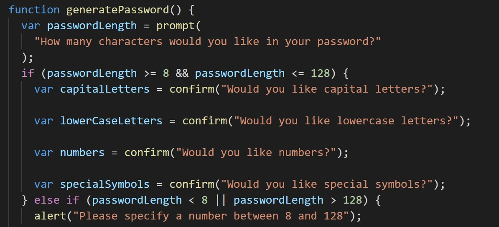
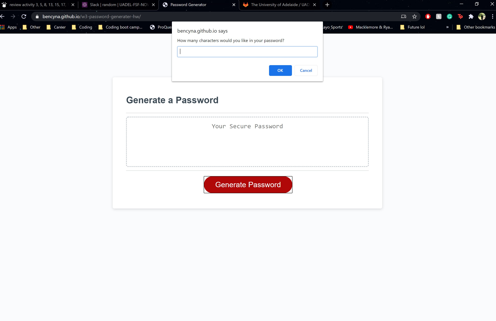

# w3-password-generater-hw
## Motivation 
This project allows the continued development of Javascript utility by incorporating action to webpages. There are many opporunities to apply the code used in this project such as functions, for loops and if else statements. This project showcases what I have learnt about javascript to incorporate code to create a webpage that is interactive. 

## Installation
- Created if statement to check user input matches requirements utilising a prompt for character length.
- User chooses available characters through series of confirms.
- Answers to confirms are stored in charSet variable. 
- For loop created to add a random character to the Password variable until the specified character length is reached.
- Password variable stores letter arrangemnents.
- Password is printed on screen

## Usage

The above images represent the code used to intitialise the prompts and confirms while also the utilisation of the code to produce the interactive user experience. A link to the workong product can be found at the bottom of this READ.me file. 

## Credits
https://adelaide.bootcampcontent.com/the-university-of-adelaide/uadel-adel-fsf-pt-11-2020-u-c.git 

## Licnece 
MIT License

Copyright (c) [2020] [Ben Cyna]

Permission is hereby granted, free of charge, to any person obtaining a copy
of this software and associated documentation files (the "Software"), to deal
in the Software without restriction, including without limitation the rights
to use, copy, modify, merge, publish, distribute, sublicense, and/or sell
copies of the Software, and to permit persons to whom the Software is
furnished to do so, subject to the following conditions:

The above copyright notice and this permission notice shall be included in all
copies or substantial portions of the Software.

THE SOFTWARE IS PROVIDED "AS IS", WITHOUT WARRANTY OF ANY KIND, EXPRESS OR
IMPLIED, INCLUDING BUT NOT LIMITED TO THE WARRANTIES OF MERCHANTABILITY,
FITNESS FOR A PARTICULAR PURPOSE AND NONINFRINGEMENT. IN NO EVENT SHALL THE
AUTHORS OR COPYRIGHT HOLDERS BE LIABLE FOR ANY CLAIM, DAMAGES OR OTHER
LIABILITY, WHETHER IN AN ACTION OF CONTRACT, TORT OR OTHERWISE, ARISING FROM,
OUT OF OR IN CONNECTION WITH THE SOFTWARE OR THE USE OR OTHER DEALINGS IN THE
SOFTWARE.

## working product 
https://bencyna.github.io/w3-password-generater-hw/ 